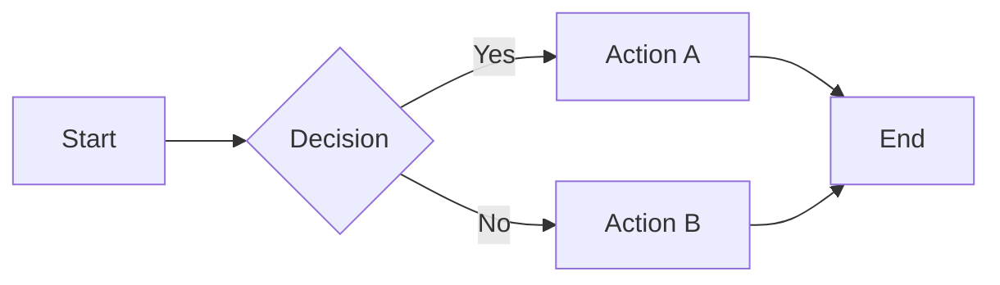
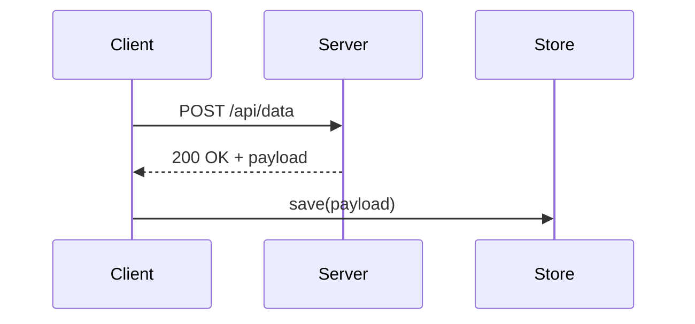
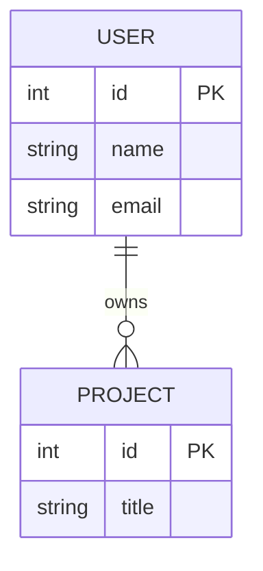
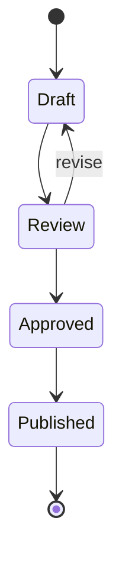

# Zensical Authoring Snippets Library

Ready-to-paste Markdown snippets for all major Zensical content elements.

## Table of Contents

1. [Front Matter](#1-front-matter)
2. [Admonitions (Callouts)](#2-admonitions-callouts)
3. [Code Blocks](#3-code-blocks)
4. [Content Tabs](#4-content-tabs)
5. [Data Tables](#5-data-tables)
6. [Diagrams](#6-diagrams)
7. [Grids](#7-grids)
8. [Images](#8-images)
9. [Buttons](#9-buttons)
10. [Icons and Emojis](#10-icons-and-emojis)
11. [Math](#11-math)
12. [Footnotes](#12-footnotes)
13. [Formatting](#13-formatting)
14. [Lists](#14-lists)
15. [Tooltips](#15-tooltips)

---

## 1. Front Matter

Placed at the top of any `.md` file between `---` delimiters.

```yaml
---
title: Page Title
description: SEO description for this page
tags:
  - Tag One
  - Tag Two
hide:
  - navigation   # optional: hide left sidebar
  - toc          # optional: hide right TOC
  - path         # optional: hide breadcrumb
---
```

---

## 2. Admonitions (Callouts)

**Requires extensions:** `admonition`, `pymdownx.details`, `pymdownx.superfences`

### Basic types

```markdown
!!! note
    Content here (indent 4 spaces).

!!! abstract
    Summary or abstract content.

!!! info
    Informational content.

!!! tip
    Helpful tip or best practice.

!!! success
    Confirmation or success message.

!!! question
    Question or FAQ item.

!!! warning
    Important warning.

!!! failure
    Failure case or known issue.

!!! danger
    Critical danger notice.

!!! bug
    Known bug documentation.

!!! example
    Usage example.

!!! quote
    Quoted material.
```

### Custom title

```markdown
!!! warning "Data Loss Risk"
    This operation cannot be undone.
```

### No title (icon-only)

```markdown
!!! note ""
    Content without a title bar.
```

### Collapsible (closed by default)

```markdown
??? note "Click to expand"
    Hidden content revealed on click.
```

### Collapsible (open by default)

```markdown
???+ note "Expanded by default"
    Visible content, toggle to collapse.
```

### Inline (right-aligned sidebar)

```markdown
!!! info inline end "Note"
    This floats to the right of adjacent content.

Main paragraph text continues here alongside the inline admonition.
```

### Inline (left-aligned)

```markdown
!!! info inline "Note"
    This floats to the left.

Main paragraph text continues here.
```

### Nested

```markdown
!!! note "Outer"
    Outer content.

    !!! tip "Inner"
        Inner content, indented 4 additional spaces.
```

---

## 3. Code Blocks

**Requires extensions:** `pymdownx.highlight`, `pymdownx.superfences`, `pymdownx.inlinehilite`

### Basic fenced block

```markdown
```python
def hello(name: str) -> str:
    return f"Hello, {name}"
```
```

### With title

```markdown
```python title="src/hello.py"
def hello(name: str) -> str:
    return f"Hello, {name}"
```
```

### With line numbers

```markdown
```python linenums="1"
line one
line two
line three
```
```

### With highlighted lines

```markdown
```python hl_lines="2 3"
line one
line two    # highlighted
line three  # highlighted
```
```

### Annotated code (numbered callouts)

```markdown
```python
def process(data):  # (1)!
    result = []     # (2)!
    return result
```

1. Entry point for all processing jobs.
2. Accumulator initialized as empty list.
```

### Inline code with syntax

```markdown
The `#!python range(10)` function generates integers.
```

---

## 4. Content Tabs

**Requires extension:** `pymdownx.tabbed` with `alternate_style = true`

```markdown
=== "Tab One"
    Content for tab one.

=== "Tab Two"
    Content for tab two.

=== "Tab Three"
    ```python
    # Code in a tab
    print("hello")
    ```
```

### Linked tabs (sync across page)

Add `content.tabs.link` to theme features. Tabs with identical labels sync across all instances on the page.

---

## 5. Data Tables

**Requires extension:** `tables`

```markdown
| Column A | Column B | Column C |
|----------|----------|----------|
| Value 1  | Value 2  | Value 3  |
| Value 4  | Value 5  | Value 6  |
```

### Alignment

```markdown
| Left     | Center   | Right    |
|:---------|:--------:|---------:|
| left     | center   | right    |
```

### Sortable tables (via theme feature)

Add `content.tables.sort` to theme features for sortable column headers.

---

## 6. Diagrams

**Requires extension:** `pymdownx.superfences` (Mermaid.js is built in)

### Flowchart

```markdown

```

### Sequence diagram

```markdown

```

### Entity-relationship

```markdown

```

### State diagram

```markdown

```

---

## 7. Grids

**Requires extension:** `attr_list` + `md_in_html`

### Card grid

```markdown
<div class="grid cards" markdown>

- :material-clock-fast: **Fast setup**

    Install in minutes, deploy anywhere.

- :material-file-document: **Markdown-first**

    Write docs, not code.

</div>
```

### Generic grid (equal columns)

```markdown
<div class="grid" markdown>

Content in column one.

Content in column two.

</div>
```

---

## 8. Images

**Requires extension:** `attr_list`

### Basic image

```markdown

```

### Image with caption (via figure)

```markdown
{ width="600" }
```

### Aligned right

```markdown
{ align=right }
```

### Aligned left

```markdown
{ align=left }
```

### Dark/light mode variants

```markdown


```

---

## 9. Buttons

**Requires extension:** `attr_list`

### Primary button

```markdown
[Get Started](get-started.md){ .md-button .md-button--primary }
```

### Secondary button

```markdown
[Learn More](learn-more.md){ .md-button }
```

### External link button

```markdown
[GitHub](https://github.com/org/repo){ .md-button .md-button--primary target="_blank" }
```

---

## 10. Icons and Emojis

**Requires extension:** `pymdownx.emoji`

```markdown
:material-check:          <!-- Material Design icon -->
:octicons-info-16:        <!-- Octicons -->
:fontawesome-solid-star:  <!-- FontAwesome -->
:smile:                   <!-- Twemoji emoji -->
```

Use in headings, tables, admonitions, and running text.

---

## 11. Math

**Requires extension:** `pymdownx.arithmatex` with `generic = true`
**Also requires:** MathJax or KaTeX in `extra_javascript`

### Inline math

```markdown
The formula $E = mc^2$ describes mass-energy equivalence.
```

### Block math

```markdown
$$
\int_0^\infty e^{-x^2} dx = \frac{\sqrt{\pi}}{2}
$$
```

---

## 12. Footnotes

**Requires extension:** `footnotes`

```markdown
This statement requires a source.[^1]

[^1]: Citation or explanatory note here.
```

---

## 13. Formatting

**Requires extension:** `pymdownx.caret`, `pymdownx.mark`, `pymdownx.tilde`

```markdown
^^Insert text^^          <!-- underline -->
~~Strikethrough~~        <!-- strikethrough -->
==Highlighted text==     <!-- highlight/mark -->
^superscript^            <!-- superscript -->
~subscript~              <!-- subscript -->
**Bold**
*Italic*
***Bold italic***
`inline code`
```

**Keyboard keys** (requires `pymdownx.keys`):
```markdown
++ctrl+alt+del++
++cmd+shift+p++
++enter++
```

---

## 14. Lists

### Unordered

```markdown
- Item one
- Item two
    - Nested item
    - Another nested
- Item three
```

### Ordered

```markdown
1. First
2. Second
3. Third
```

### Task list (requires `pymdownx.tasklist`)

```markdown
- [x] Completed task
- [ ] Pending task
- [x] Another done
```

### Definition list (requires `def_list`)

```markdown
Term One
:   Definition of term one.

Term Two
:   First definition.
:   Second definition.
```

---

## 15. Tooltips

**Requires extensions:** `abbr`, `pymdownx.snippets`, `attr_list`

### Abbreviation (auto-tooltip on first use)

Place in a `docs/abbreviations.md` snippet file, then include via snippets:

```markdown
<!-- abbreviations.md -->
*[SME]: Subject Matter Expert
*[API]: Application Programming Interface
*[CLI]: Command Line Interface
```

Include in pages or globally via `snippets` extension with `auto_append`:

```toml
[project.markdown_extensions.pymdownx.snippets]
auto_append = ["docs/abbreviations.md"]
```

### Inline tooltip (title attribute)

```markdown
[Hover me](link.md "Tooltip text appears on hover"){ title="Tooltip text" }
```