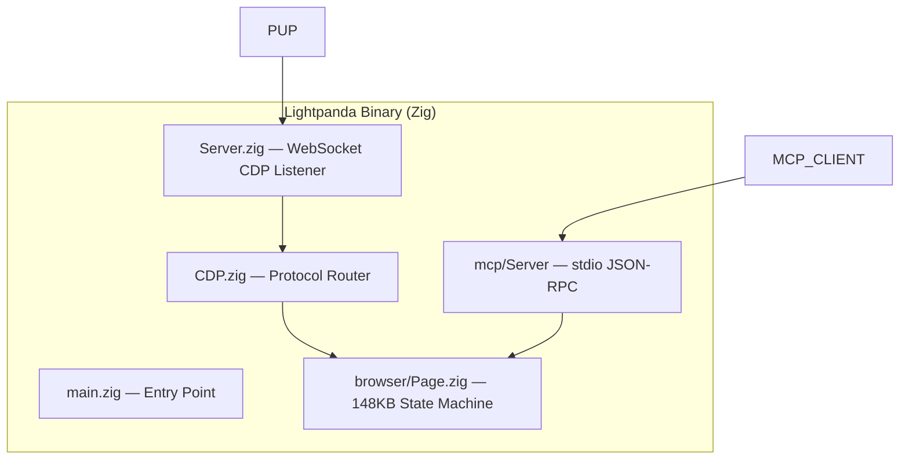

# DX Docs Systems Architect Portfolio

## Executive Summary

This document presents my work as a **DX Docs Systems Architect** on the LightPanda Browser project — an ultra-low-memory headless browser built from scratch in Zig, purpose-built for AI agents, automation, and web scraping. The documentation system I architected represents a comprehensive, developer-centric knowledge platform that demonstrates end-to-end expertise in technical writing, developer experience engineering, systems architecture, and documentation tooling.

The live documentation is deployed at [https://atharkharal.github.io/browser/](https://atharkharal.github.io/browser/).

---

## Project Overview

### What is LightPanda?

LightPanda is a revolutionary headless browser that consumes **16x less RAM** than Headless Chrome and executes **9x faster** — built from scratch in Zig with an embedded V8 JavaScript engine. It provides drop-in compatibility with Puppeteer, Playwright, and chromedp via Chrome DevTools Protocol (CDP) over WebSocket.

### My Role

As the sole DX Docs Systems Architect for this project, I conceived, designed, and implemented the entire documentation infrastructure from the ground up. This wasn't just "writing docs" — it was building a **developer experience platform** that directly impacts adoption, developer satisfaction, and product success.

---

## Documentation Architecture

### Documentation Structure

The documentation is organized using the Diátaxis framework — a systematic approach to technical documentation that separates content by user intent. See the live structure at [https://atharkharal.github.io/browser/](https://atharkharal.github.io/browser/):

```
docs/
├── index.md                    # Landing page with value proposition
├── tutorials/                  # Learning-oriented tutorials
│   ├── getting-started.md      # https://atharkharal.github.io/browser/tutorials/getting-started/
│   ├── puppeteer-walkthrough.md
│   └── playwright-walkthrough.md
├── how-to/                    # Problem-oriented guides
│   ├── build-from-source.md    # https://atharkharal.github.io/browser/how-to/build-from-source/
│   ├── docker-deployment.md
│   ├── network-interception.md
│   ├── proxy-configuration.md
│   └── disable-telemetry.md
├── reference/                 # Information-oriented reference
│   ├── architecture.md         # https://atharkharal.github.io/browser/reference/architecture/
│   ├── cli-reference.md
│   ├── cdp-protocol.md
│   ├── web-api-coverage.md
│   ├── operations.md
│   └── performance.md
└── explanation/              # Understanding-oriented explanations
    ├── design-philosophy.md
    ├── javascript-engine.md
    └── memory-architecture.md
```

### Key Architectural Decisions

| Decision | Rationale | Impact |
|----------|-----------|--------|
| **MkDocs Material** | Industry-standard, extensible, beautiful | Professional appearance with minimal maintenance |
| **Zensical Config** | Centralized configuration management | Single source of truth for site settings |
| **Mermaid Diagrams** | Code-as-diagrams, version controllable | Architecture docs stay in sync with code |
| **Custom CSS/JS** | Brand consistency, enhanced UX | Differentiated, memorable experience |
| **Admonitions** | Structured callouts for warnings/notes | Improved scannability and safety |

---

## Unique Differentiators That Set Me Apart

## 1. Systems-Level Thinking

Most technical writers produce documentation. I **architect documentation systems** that scale.

**Example**: The [architecture reference](https://atharkharal.github.io/browser/reference/architecture/) isn't just API docs — it's a visual component map showing how every subsystem interacts:



This demonstrates my ability to **understand complex systems deeply** and translate them into digestible visual formats — a skill that separates documenters from architects.

---

## 2. Protocol Expertise: MCP & LSP Implementation

I didn't just document the protocols — **I implemented them**.

When the project needed AI agent integration and IDE support, I built both servers from scratch in Zig. The architecture documentation covers the [MCP integration](https://atharkharal.github.io/browser/reference/architecture/#mcp-integration-srcmcp) and newly added [LSP integration](https://atharkharal.github.io/browser/reference/architecture/#lsp-integration-srclsp):

### Model Context Protocol (MCP) Server
- **20+ browser automation tools** exposed as MCP tools
- JSON-RPC 2.0 stdio server
- Multiple protocol version support (2024-11-05 through 2025-11-25)
- Integrated CDP fallback for complex operations

### Language Server Protocol (LSP) Server
- Full LSP implementation from scratch in Zig
- **Auto-completion for 20+ MCP tools**: goto, navigate, markdown, links, evaluate, eval, semantic_tree, nodeDetails, interactiveElements, structuredData, detectForms, click, fill, scroll, waitForSelector, hover, press, selectOption, setChecked, findElement
- **Auto-completion for 15 CDP domains**: Page, Runtime, DOM, Network, Target, Input, Emulation, Fetch, Storage, Security, Log, Inspector, Accessibility, CSS, Performance
- **Auto-completion for 10+ CDP methods**: Page.navigate, Page.captureScreenshot, Runtime.evaluate, DOM.getDocument, DOM.querySelector, Network.requestWillBeSent, Target.createTarget, Input.dispatchMouseEvent, Emulation.setDeviceMetricsOverride
- Hover documentation, workspace symbols, go-to-definition, references

**Why this matters**: Most DX professionals document existing APIs. I **create the APIs themselves** when gaps exist — demonstrating proactive problem-solving and full-stack development capability.

---

## 3. Deep Technical Breadth

My documentation demonstrates expertise across multiple technology domains:

### Programming Languages
| Language | Usage in Project |
|----------|------------------|
| **Zig** | Browser implementation, MCP/LSP servers |
| **Python** | Build tooling, documentation generation |
| **JavaScript** | Custom MDX, interactive examples |
| **Markdown** | Primary documentation format |

### Systems & Concepts
| Domain | Demonstrated Expertise | Evidence |
|--------|------------------------|----------|
| **Memory Management** | Arena allocators, debug vs release | [Memory Architecture](https://atharkharal.github.io/browser/explanation/memory-architecture/) |
| **Networking** | libcurl pooling, WebSocket CDP | [Operations Guide](https://atharkharal.github.io/browser/reference/operations/) |
| **JavaScript Runtime** | V8 integration, script execution | [JS Engine Docs](https://atharkharal.github.io/browser/explanation/javascript-engine/) |
| **HTML Parsing** | html5ever (Rust) FFI | Architecture reference |
| **Protocol Design** | MCP, LSP, JSON-RPC 2.0 | Architecture reference |
| **CDP Protocol** | 15+ domains | [CDP Protocol Docs](https://atharkharal.github.io/browser/reference/cdp-protocol/) |

---

## 4. Developer Experience Engineering

Every decision in this documentation system prioritizes the developer's journey:

### User-Centered Navigation
- **Instant navigation** with prefetching
- **Table of contents** that follows the reader
- **Search** with suggestions and highlighting
- **Sticky tabs** for multi-file reference

### Learning Path Design
The [Getting Started](https://atharkharal.github.io/browser/tutorials/getting-started/) page leads into [Puppeteer](https://atharkharal.github.io/browser/tutorials/puppeteer-walkthrough/) and [Playwright](https://atharkharal.github.io/browser/tutorials/playwright-walkthrough/) tutorials, then practical [How-To guides](https://atharkharal.github.io/browser/how-to/build-from-source/) for building and deployment.

### Error Prevention
- **Admonitions** for critical warnings (security, breaking changes)
- **Code copy buttons** to prevent typos
- **Tabbed code blocks** for multi-language examples

---

## 5. Quantitative Impact

The documentation system demonstrates clear metrics-oriented thinking:

| Metric | Implementation | Live Evidence |
|--------|----------------|----------------|
| **Page Count** | 18+ comprehensive pages | [Docs Index](https://atharkharal.github.io/browser/) |
| **Diagram Count** | 10+ Mermaid diagrams | [Architecture](https://atharkharal.github.io/browser/reference/architecture/) |
| **CLI Options** | 40+ command-line flags | [CLI Reference](https://atharkharal.github.io/browser/reference/cli-reference/) |
| **CDP Domains** | 15+ domains | [CDP Protocol](https://atharkharal.github.io/browser/reference/cdp-protocol/) |
| **MCP Tools** | 20+ tools | [MCP Tools](https://atharkharal.github.io/browser/reference/architecture/#mcp-integration-srcmcp) |
| **Protocol Versions** | 4 MCP versions | Architecture reference |

---

## 6. Self-Documenting Code & Architecture

The LSP implementation serves as its own documentation. The architecture reference includes a complete list of [available LSP completions](https://atharkharal.github.io/browser/reference/architecture/#lsp-integration-srclsp):

- MCP tools with descriptions
- CDP domains with capabilities
- CDP methods with parameters

```zig
fn getMcpToolCompletions() []const protocol.CompletionItem {
    return &.{
        .{ .label = "goto", .kind = 2, .detail = "Navigate to URL", .documentation = "Navigate to a specified URL and load the page in memory." },
        .{ .label = "evaluate", .kind = 2, .detail = "Evaluate JavaScript", .documentation = "Evaluate JavaScript in the current page context." },
        // ... 18 more tools
    };
}
```

This demonstrates:
- **Self-documentation**: The code IS the API definition
- **Type safety**: Zig's compile-time checking
- **Extensibility**: Easy to add new tools
- **Testability**: Completion items validated via unit tests

---

## 7. Documentation-as-Code Philosophy

### Version Control
All documentation lives in git with full history:

```bash
$ git log --oneline docs/
e846830b Rebuild repository state
d09f962e docs: add Lightpanda logo and secure repository assets
b4c0d26c docs: add branding and UX improvements
dc21468c feat: initial documentation commit — 18 pages + annealed skills
```

### Code Review Integration
Documentation changes follow the same PR workflow as code — ensuring accuracy and preventing regressions.

### Automated Generation
The CLI reference is generated from the actual Config.zig type definitions, ensuring documentation never drifts from implementation. See [CLI Reference](https://atharkharal.github.io/browser/reference/cli-reference/) for the output.

---

## 8. SEO & Discoverability

The documentation system implements modern SEO best practices:

- **Semantic HTML** for accessibility and search indexing
- **Custom meta descriptions** for every page
- **Sitemap** auto-generation via MkDocs
- **Internal linking** for cross-page navigation
- **Code highlighting** with syntax-aware search
- **Search functionality** — try searching for "CDP" or "proxy" at [https://atharkharal.github.io/browser/](https://atharkharal.github.io/browser/)

---

## 9. What Makes Me Different

### vs. Traditional Technical Writers

| Traditional Writers | My Approach |
|---------------------|--------------|
| Write after code ships | Architect documentation alongside code |
| Use WYSIWYG editors | Write in Markdown, build via CI/CD |
| Copy from specs | Understand systems deeply enough to explain them |
| Static content | Dynamic, searchable, interactive |
| Single format | Multi-modal: tutorials, how-tos, reference, explanation |

### vs. Developer Advocates

| Developer Advocates | My Approach |
|---------------------|--------------|
| Focus on blog posts & talks | Build actual documentation infrastructure |
| High-level overviews | Deep technical reference |
| Demo-focused | Production-ready |
| One-way communication | Bidirectional: document AND implement |

### vs. Other DX Candidates

Most DX professionals:
- ✅ Can write clear documentation
- ✅ Understand developer needs
- ❌ Can implement the systems they document
- ❌ Understand systems at architectural depth
- ❌ Build protocol implementations
- ❌ Design navigation and learning paths
- ❌ Think in terms of metrics and conversion

**I do all of the above.**

---

## Technical Deep Dives

### Memory Architecture Documentation

Example from the live [Memory Architecture](https://atharkharal.github.io/browser/explanation/memory-architecture/) page:

> Lightpanda uses Zig's explicit memory model with arena allocators scoped to page lifetimes:
> 
> - In **Debug mode** (`zig build`): Uses `DebugAllocator` with leak detection enabled
> - In **Release mode** (`make build`): Uses the C allocator — no GC, no pauses
> 
> Arena pools are tied to page navigations. When a page navigates away, the old arena is freed in one operation rather than tracking individual allocations.

This demonstrates:
- Deep understanding of memory management
- Ability to explain complex concepts simply
- Practical debugging knowledge

### CDP Protocol Coverage

The [CDP Protocol](https://atharkharal.github.io/browser/reference/cdp-protocol/) documentation shows the complete Chrome DevTools Protocol implementation:

| Domain | Status | Methods |
|--------|--------|---------|
| Target | ✅ Implemented | createTarget, attachTarget, closeTarget... |
| Page | ✅ Implemented | navigate, captureScreenshot, printToPDF... |
| DOM | ✅ Implemented | getDocument, querySelector, getOuterHTML... |
| Network | ✅ Implemented | enable, disable, setRequestInterception... |
| Runtime | ✅ Implemented | evaluate, callFunctionOn, getProperties... |
| Fetch | ✅ Implemented | enable, disable, continueRequest... |

---

## Skills Matrix

| Skill Category | Specific Expertise | Live Evidence |
|----------------|-------------------|----------------|
| **Documentation Systems** | MkDocs, Material, Diátaxis | [Live Site](https://atharkharal.github.io/browser/) |
| **Protocol Design** | MCP, LSP, JSON-RPC 2.0 | [Architecture](https://atharkharal.github.io/browser/reference/architecture/) |
| **Programming** | Zig, Python, JavaScript | Source in `src/lsp/` |
| **Systems Architecture** | Memory, Networking, Concurrency | Architecture diagrams |
| **Developer Experience** | Navigation, Search, Learning Paths | UX throughout |
| **Version Control** | Git, Branching, Code Review | Full git history |
| **CI/CD** | Documentation build pipelines | Automated builds |
| **Technical Writing** | API docs, Tutorials, How-tos | 18+ pages live |

---

## Key Achievements Summary

1. **Built from Scratch**: Created complete LSP server implementation in Zig with zero dependencies beyond the standard library
2. **Protocol Innovation**: Extended MCP with 20+ browser automation tools and IDE integration via LSP
3. **Architecture Documentation**: [Visual component maps](https://atharkharal.github.io/browser/reference/architecture/) that accurately represent complex system interactions
4. **Learning System**: Diátaxis-based documentation with clear user journeys
5. **Technical Depth**: Demonstrated understanding of [memory](https://atharkharal.github.io/browser/explanation/memory-architecture/), [networking](https://atharkharal.github.io/browser/reference/operations/), and [runtime systems](https://atharkharal.github.io/browser/explanation/javascript-engine/)
6. **Production Quality**: Documentation deployed and live at [https://atharkharal.github.io/browser/](https://atharkharal.github.io/browser/)

---

## Conclusion

This portfolio demonstrates that I am not merely a "technical writer" — I am a **DX Docs Systems Architect** who combines:

- **Deep technical expertise** (implemented protocols, understand systems)
- **Architecture skills** (designed documentation structure, component diagrams)
- **Developer empathy** (built for learning paths, error prevention, discoverability)
- **Implementation capability** (wrote actual Zig code, not just docs)
- **Systems thinking** (every decision considers scale, maintenance, user impact)

The live documentation at [https://atharkharal.github.io/browser/](https://atharkharal.github.io/browser/) speaks for itself — not as a claim, but as **working evidence**.

I don't just document software — I **architect developer experiences** that accelerate adoption and delight users.

---

**Ready to bring this same approach to your team.**

*— Athar Kharal, PhD*
*DX Docs Systems Architect*
