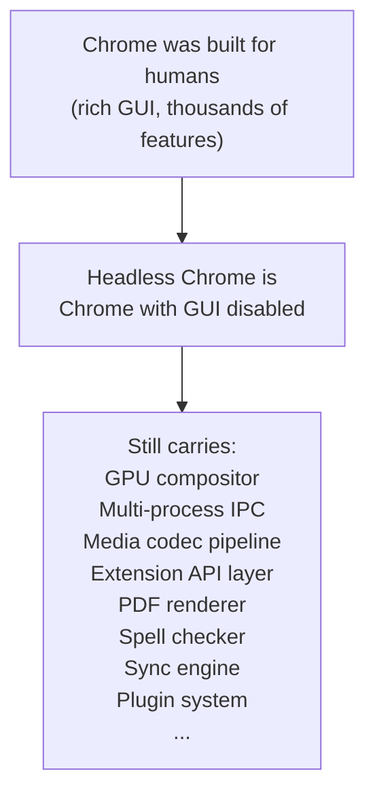

# Design Philosophy

This document explains the technical and strategic decisions that make Lightpanda a different kind of browser, and why those decisions are the correct response to the demands of modern server-side automation.

---

## The Problem with Existing Solutions

### JavaScript Became Mandatory

In the early web, `curl` was sufficient for data collection. A single HTTP GET request returned a complete HTML document that could be immediately parsed.

Today this is no longer true for the majority of the web:

- Single-Page Applications (SPAs) ship an empty HTML shell and populate it with React, Vue, or Angular after JavaScript executes.
- Commerce platforms rely on client-side pricing, inventory, and personalization logic that never appears in the initial HTTP response.
- Infinite scroll, lazy loading, and "click to display" patterns require interaction to trigger further content loads.
- Ajax and Fetch calls retrieve data from internal APIs and write it into the DOM dynamically.

Any automation or data collection system targeting the modern web must execute JavaScript.

### The Chromium Tax

The natural response was to use an existing browser. Google Chrome is the dominant browser. Headless Chrome started as a way to run it without a graphical display.

Headless Chrome works. It correctly executes JavaScript. However, it carries a fundamental architectural mismatch:

Each Chrome instance at rest consumes ~80–200MB of memory. At scale — hundreds or thousands of concurrent browser sessions — this translates directly into infrastructure cost. Chrome was never designed to run 500 instances on a single server.

---

## The Lightpanda Thesis

If the requirement is JavaScript execution in a server context, then the correct design is a browser that implements only what that requirement demands.

Lightpanda is built from a blank design slate. Not another iteration of Chromium. Not a WebKit patch. A new browser.

The design is guided by three constraints:

**1. Only implement what automation needs.**
No GPU rendering. No PDF generation. No media codecs. No extension system. No spell checker. The absence of these subsystems is not a limitation — it is the point. Every kilobyte of code not shipped is memory not consumed and a path not subject to failure.

**2. Use a language designed for performance-critical systems programming.**
Zig provides explicit memory management without a garbage collector. There are no stop-the-world events, no GC pauses that spike latency during JavaScript execution. Memory is allocated in arenas tied to page lifetimes and freed in a single operation.

**3. Standards compliance within scope.**
The HTML parser uses html5ever (the same parser Servo uses), which implements the HTML5 parsing specification. The JavaScript engine is V8. The HTTP loader is libcurl. These are battle-tested implementations that correctly handle real-world HTML, JavaScript, and HTTP quirks. No effort is spent on reinventing components where proven, audited implementations exist.

---

## Tradeoffs and Their Rationale

### No Layout Engine

Lightpanda does not compute CSS layout. This means `getBoundingClientRect()` returns zero for all elements. Scripts that depend on element positioning will not behave identically to a full browser.

**Rationale:** The vast majority of automation and scraping workflows do not require layout information. Data extraction, form submission, link discovery, and API interaction do not need pixel coordinates. Implementing a full CSS layout engine would dramatically increase code complexity, memory consumption, and attack surface without benefiting the primary user base.

**Mitigation:** If your workflow requires element bounds, reconsider whether it strictly requires layout or whether the dependency can be removed from the scraping logic.

### Single V8 Isolate per Page

Each page operates within a single V8 isolate. Workers and SharedArrayBuffer APIs have constrained support due to this model.

**Rationale:** Multi-isolate architectures introduce significant synchronization complexity and memory overhead. For server-side automation, this tradeoff favors simplicity.

### CORS Not Enforced

Cross-Origin Resource Sharing is not currently enforced. Scripts can make cross-origin requests without the corresponding CORS headers on the server.

**Rationale:** For automation workflows, CORS is a browser security mechanism that protects users in a GUI context. In a controlled server-side environment, CORS enforcement does not add security value. It is tracked as a future implementation milestone.

---

## Security Model

Lightpanda is designed to operate in a controlled server environment where the automation operator controls which URLs are visited. It is not designed to be a safe browser for untrusted web content from an end-user perspective.

Do not use Lightpanda in contexts where untrusted JavaScript from arbitrary web pages could affect the host system through vulnerabilities in the browser engine itself. The security priorities of Lightpanda are:

- Correct implementation of network-level safety (TLS, proxy auth, bot auth headers)
- Correct robots.txt compliance enforcement when opted in
- Reliable sandboxing at the process level (each Lightpanda process is isolated)

Content sandbox isolation (e.g., preventing JavaScript from reading host filesystem) relies on the fact that the V8 API surface exposed by Lightpanda does not provide access to host resources. This is a structural guarantee, not a runtime enforcement mechanism.
