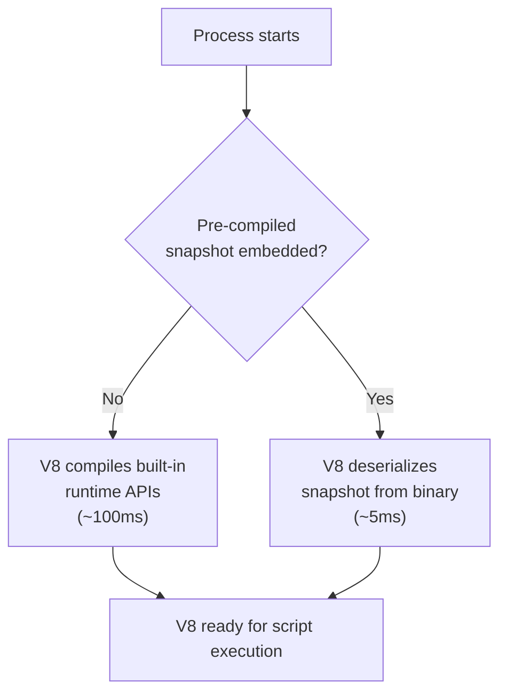
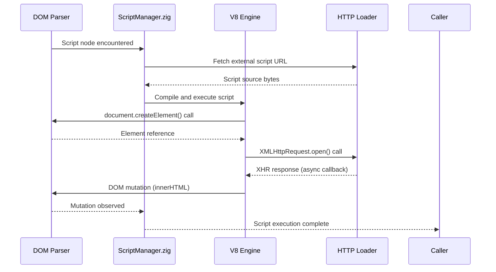
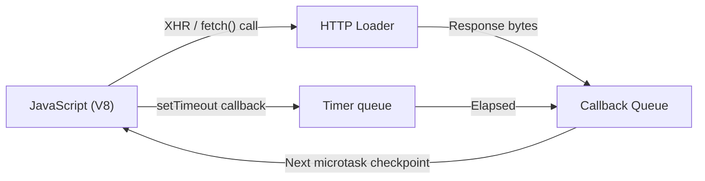

# JavaScript Engine

Lightpanda uses Google's V8 JavaScript engine — the same engine powering Node.js and Chrome — to evaluate JavaScript within page contexts. This document explains how V8 is integrated, how the snapshot optimization works, and how JavaScript execution is coordinated with the DOM.

---

## Why V8

V8 is the only JavaScript engine that combines:
- Full ECMAScript specification compliance
- Production-grade performance under sustained workloads
- Proven handling of real-world JavaScript codebases (React, Angular, Vue, etc.)
- Active maintenance aligned with the JavaScript language specification

Writing a custom JavaScript engine is a decade-scale engineering endeavor. Lightpanda embeds V8 as a dependency and focuses its engineering effort on the surrounding browser infrastructure.

---

## V8 Startup and the Snapshot Mechanism

V8 requires significant initialization when first started:



The V8 snapshot captures the compiled state of the JavaScript built-ins (Object, Array, Promise, etc.). By embedding this snapshot in the Lightpanda binary, startup time drops from ~100ms to ~5ms.

To build with an embedded snapshot:
```bash
# Step 1: Generate the snapshot binary
zig build snapshot_creator -- src/snapshot.bin

# Step 2: Embed it into the final binary
zig build -Doptimize=ReleaseFast -Dsnapshot_path=../../snapshot.bin
```

Without this optimization, the snapshot is generated fresh at every process start.

---

## JavaScript Execution Model

Each page has one V8 isolate. Execution within a page is single-threaded from V8's perspective, but JavaScript's asynchronous model (Promises, async/await, event listeners) is fully supported.



Script execution is managed by `browser/ScriptManager.zig`. It handles:
- Inline `<script>` tag execution in document order
- External `<script src="...">` fetching and execution
- Deferred scripts (`defer` attribute)
- Dynamic imports and `import()` expressions

---

## Event Loop Integration

Lightpanda implements a minimal event loop that coordinates V8 microtasks with the network layer. When a `fetch()` or `XMLHttpRequest` resolves, the network layer notifies the JavaScript event loop, which re-enters V8 to execute the pending callbacks.



This is a simplified cooperative event loop rather than a browser-grade event loop with full macro/microtask prioritization. For most automation workloads, this is sufficient.

---

## Limitations

!!! warning "No Web Workers"
    Web Worker APIs (`Worker`, `SharedWorker`, `ServiceWorker`) are not supported in the current implementation. Scripts that depend on workers for parallel computation will fail to use the worker path but may degrade gracefully if the worker is used for progressive enhancement only.

!!! warning "No requestAnimationFrame Timing"
    `requestAnimationFrame()` is implemented as a stub that fires callbacks immediately rather than synchronized to a display refresh rate (which does not exist in a headless context). Scripts that use `requestAnimationFrame` for animation timing may accumulate callbacks faster than intended. If this causes issues, intercept the page and replace the callback with a `setTimeout(fn, 16)` equivalent.

!!! info "ECMAScript Version"
    V8's ECMAScript version corresponds to the V8 version linked in the build. Lightpanda tracks a recent V8 release. All mainstream ES2022+ language features are available.
