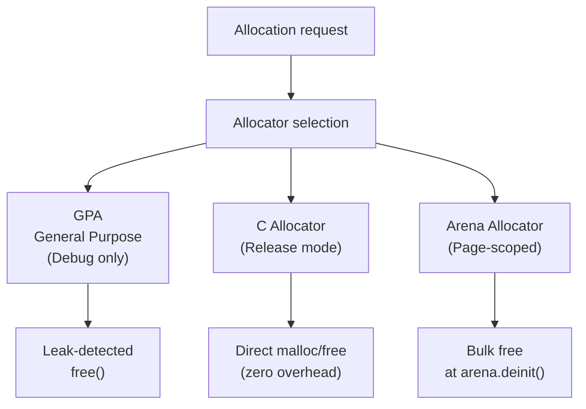

# Memory Architecture

Lightpanda's memory model is one of its most significant design differentiators from Chromium-based browsers. This document explains how Zig's explicit memory management and arena allocators produce a low-memory, zero-GC-pause execution environment.

---

## The GC Problem in Browser Automation

Traditional managed-runtime browsers rely on garbage collectors to reclaim memory. GC introduces:
- **Unpredictable pauses** — the collector runs on its own schedule, not yours
- **Heap fragmentation** — long-running processes accumulate fragmented heap regions
- **Memory overhead** — managed runtimes typically reserve 2–3x the working set memory

For automation workloads processing thousands of pages, GC pauses manifest as latency spikes that compound across concurrent sessions.

---

## Zig's Explicit Memory Model

Zig has no garbage collector and no runtime. Every heap allocation is explicit — the programmer specifies the allocator, the lifetime, and the deallocation point.



In **Debug mode** (`zig build`), Lightpanda uses the `DebugAllocator` (GPA) which tracks every allocation. At process exit, any unreleased allocation is reported with a stack trace. This ensures the production binary ships with no memory leaks.

In **Release mode** (`make build`), Lightpanda uses `std.heap.c_allocator`, which maps directly to the system `malloc`/`free`. There is no GC, no intermediate tracking layer.

---

## Arena Allocators and Page Lifetime Scoping

The most impactful memory pattern in Lightpanda is arena allocation scoped to page lifetimes.

An arena allocator works by:
1. Allocating a large memory region upfront
2. Serving sub-allocations from that region using a bump pointer (incrementing the pointer by the requested size)
3. Freeing the entire region at once when the arena is reset

```mermaid
sequenceDiagram
    participant PAGE as "Page navigation starts"
    participant ARENA as "ArenaPool.zig"
    participant DOM as "DOM tree"
    participant JS as "JavaScript (V8)"
    participant END as "Page closes"

    PAGE->>ARENA: arena.init()
    ARENA-->>PAGE: allocator handle
    PAGE->>DOM: allocate nodes using arena
    PAGE->>JS: allocate script buffers using arena
    JS->>DOM: DOM mutations (arena-backed)
    END->>ARENA: arena.deinit()
    ARENA-->>END: All page memory freed in one operation
```

Instead of tracking every DOM node, string buffer, and intermediate result individually, Lightpanda allocates them all from the page arena. When the page closes, a single `deinit()` call frees everything. There is no per-object bookkeeping.

This approach guarantees:
- Zero memory leaks between page navigations
- Constant-time teardown regardless of how many objects were allocated during the page's lifetime
- No heap fragmentation from short-lived objects

---

## Memory Per Component

Approximate baseline memory cost per running Lightpanda process:

| Component | Approximate Footprint |
|---|---|
| V8 engine (without snapshot) | ~15–20MB |
| V8 engine startup (with embedded snapshot) | ~10MB |
| libcurl connection pool (idle) | ~1MB |
| html5ever parser | ~500KB |
| Base arena allocation per page | ~1–2MB |
| Complex SPA page (XHR-heavy) | ~10–30MB additional |

A fully idle `serve` process ready to accept connections uses approximately **10MB total**, compared to Chrome's ~80–200MB minimum.

---

## Leak Detection in Development

When building in Debug mode, exit the process normally and inspect stderr:

```bash
zig build run -- serve
# Ctrl-C or send SIGTERM

# Output if clean:
# (no output)

# Output if leak detected:
# error: memory leaked (12 allocations, 1024 bytes)
# call stack:
#   browser/Page.zig:1234
```

This guarantees that any memory introduced by new code is caught during development before it reaches production.

---

## Comparison with Chromium Memory Model

| Property | Lightpanda | Chrome (Headless) |
|---|---|---|
| GC pauses | None | Yes (V8 GC) |
| Per-process baseline | ~10MB | ~80–200MB |
| Page memory teardown | Instant (arena.deinit) | GC-scheduled |
| Allocation tracking | Compile-time mode switch | Runtime instrumentation |
| Memory leak detection | Build-time (Debug mode GPA) | Runtime profiling tools |

The net result is that Lightpanda consumes approximately **16x less memory** than Chrome for equivalent automation workloads, with zero GC-induced latency spikes.
