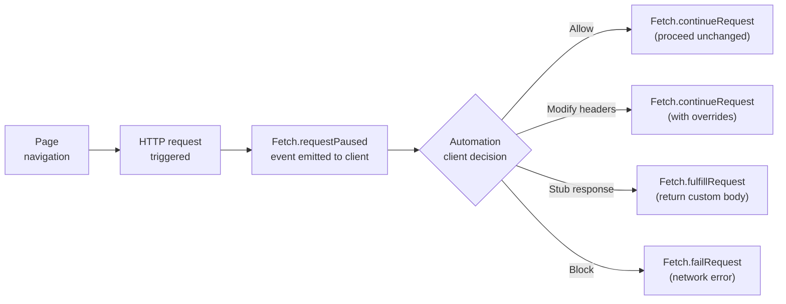

# Network Interception

Lightpanda implements the CDP `Fetch` domain, enabling request interception before outbound HTTP calls are made. Use this to block unwanted resource types, inject custom headers, stub API responses, or analyze traffic patterns.

---

## How Interception Works



---

## Enabling Interception via Puppeteer

```javascript
// Enable interception
await page.setRequestInterception(true);

// Register the handler
page.on('request', request => {
  const url = request.url();
  const resourceType = request.resourceType();

  // Block all image requests to speed up scraping
  if (resourceType === 'image') {
    request.abort();
    return;
  }

  // Block third-party analytics
  if (url.includes('google-analytics.com') || url.includes('doubleclick.net')) {
    request.abort();
    return;
  }

  // Allow everything else
  request.continue();
});

await page.goto('https://example.com/product-catalog', {
  waitUntil: 'networkidle0',
});
```

!!! warning "Always resolve every request"
    Every intercepted request must be resolved with exactly one of: `request.continue()`, `request.abort()`, or `request.respond()`. Failing to resolve a request will cause the page to hang indefinitely waiting for a response.

---

## Stubbing API Responses

Use response stubbing to test against controlled data or speed up development:

```javascript
await page.setRequestInterception(true);

page.on('request', request => {
  if (request.url().includes('/api/products')) {
    // Return a mock JSON payload
    request.respond({
      status: 200,
      contentType: 'application/json',
      body: JSON.stringify([
        { id: 1, name: 'Widget A', price: 9.99 },
        { id: 2, name: 'Widget B', price: 19.99 },
      ]),
    });
    return;
  }
  request.continue();
});
```

---

## Injecting Request Headers

Add custom headers to all outbound requests (e.g., authorization headers for authenticated APIs):

```javascript
await page.setExtraHTTPHeaders({
  'Authorization': 'Bearer your-token-here',
  'X-Custom-Header': 'value',
});
// All subsequent navigations and XHR calls will include these headers
await page.goto('https://api.example.com/data');
```

To add headers selectively via interception:
```javascript
await page.setRequestInterception(true);

page.on('request', request => {
  if (request.url().startsWith('https://api.example.com/')) {
    request.continue({
      headers: {
        ...request.headers(),
        'Authorization': 'Bearer your-token',
      },
    });
    return;
  }
  request.continue();
});
```

---

## Latency Recording

Record request timings for performance analysis:

```javascript
const timings = [];

page.on('request', req => {
  timings.push({ url: req.url(), start: Date.now(), end: null });
});

page.on('response', res => {
  const entry = timings.find(t => t.url === res.url() && t.end === null);
  if (entry) entry.end = Date.now();
});

await page.goto('https://example.com');

const report = timings.map(t => ({
  url: t.url,
  duration_ms: t.end - t.start,
}));
console.table(report);
```
