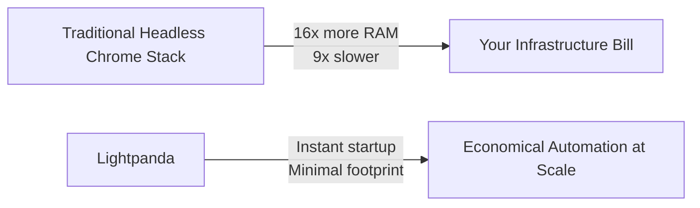

# Lightpanda Browser

<div class="grid cards" markdown>

- **Ultra-Low Memory**

    Consumes 16x less RAM than Headless Chrome, making large-scale scraping financially viable at any concurrency level.

- **9x Faster Execution**

    Benchmarked against chromedp requesting 933 real web pages on AWS EC2 m5.large. Zero startup delay.

- **CDP Compatible**

    Drop-in replacement for Puppeteer, Playwright, and chromedp via the Chrome DevTools Protocol (WebSocket).

- **JavaScript Native**

    Executes JavaScript via an embedded V8 engine with full support for XHR, Fetch API, and DOM APIs.

- **Purpose-Built for Headless**

    Not a Chromium fork. No graphical rendering pipeline. Written from scratch in Zig to eliminate overhead that does not serve automation workloads.

- **MCP Server Built-In**

    Exposes a Model Context Protocol (MCP) server over stdio, enabling native integration with AI agent toolchains.

</div>

---

## The Case for Lightpanda



The modern web requires JavaScript execution. That requirement has historically forced developers to run bloated browser instances designed for human graphical interactions. Lightpanda eliminates that constraint by building only what headless automation actually needs.

---

## Quick Start

=== "Binary (Linux)"
    ```bash
    curl -L -o lightpanda \
      https://github.com/lightpanda-io/browser/releases/download/nightly/lightpanda-x86_64-linux
    chmod a+x ./lightpanda
    ./lightpanda serve --host 127.0.0.1 --port 9222
    ```

=== "Binary (macOS)"
    ```bash
    curl -L -o lightpanda \
      https://github.com/lightpanda-io/browser/releases/download/nightly/lightpanda-aarch64-macos
    chmod a+x ./lightpanda
    ./lightpanda serve --host 127.0.0.1 --port 9222
    ```

=== "Docker"
    ```bash
    docker run -d --name lightpanda -p 9222:9222 lightpanda/browser:nightly
    ```

Once running, connect your existing Puppeteer or Playwright script by pointing `browserWSEndpoint` to `ws://127.0.0.1:9222`. No other changes required.

---

## Status and Coverage

!!! abstract "Beta Status"
    Lightpanda is in active Beta. Stability and Web API coverage improve with each release. Report issues at [github.com/lightpanda-io/browser/issues](https://github.com/lightpanda-io/browser/issues).

| Category | Component | Status |
|---|---|---|
| Network | HTTP loader (libcurl) | Stable |
| Parsing | HTML parser (html5ever) | Stable |
| Scripting | JavaScript (V8) | Stable |
| DOM | DOM tree and Core APIs | Stable |
| Network | XHR API | Stable |
| Network | Fetch API | Stable |
| Automation | CDP / WebSocket server | Stable |
| Input | Click, forms, keyboard | Stable |
| State | Cookies | Stable |
| Network | Custom HTTP headers | Stable |
| Network | Proxy support | Stable |
| Network | Network interception | Stable |
| Policy | robots.txt compliance | Stable |
| Security | CORS | In Progress |

---

[Get Started](tutorials/getting-started.md){ .md-button .md-button--primary }
[View Architecture](reference/architecture.md){ .md-button }
