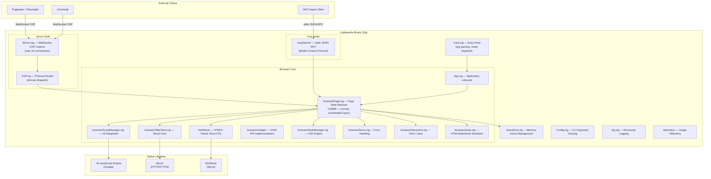
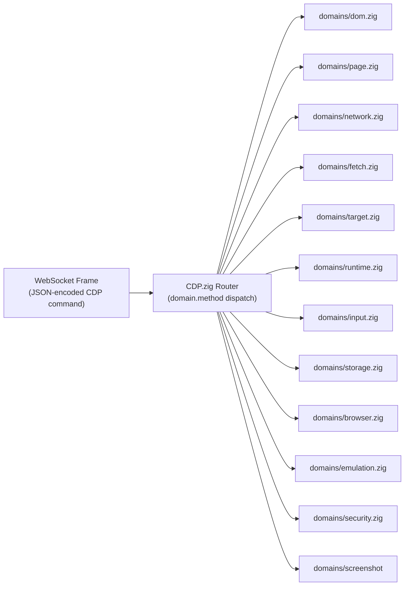
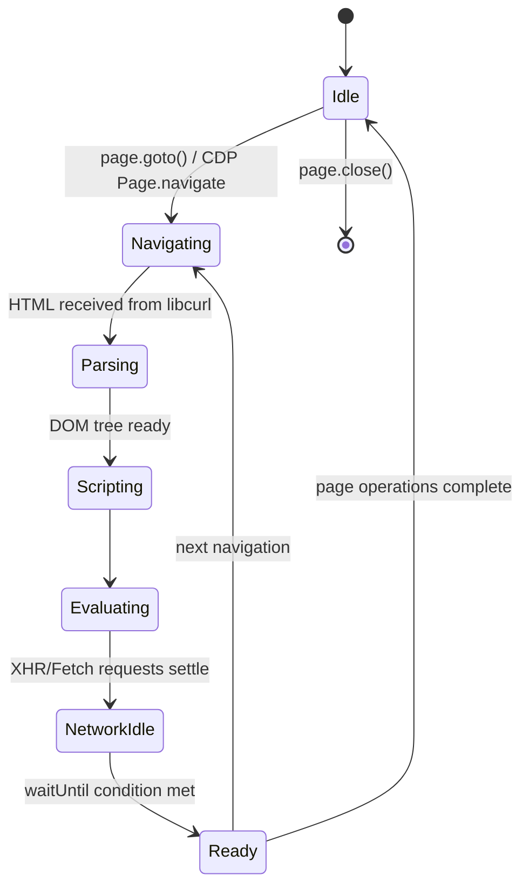

# Architecture Reference

Lightpanda is a single-binary application that implements a complete headless browser stack. This document maps every major internal subsystem, its responsibilities, and how it interacts with adjacent components.

---

## High-Level Component Map

---

## Entry and Dispatch (`main.zig`, `Config.zig`)

The binary parses command-line arguments and dispatches into one of four operational modes:

| Mode | Description |
|---|---|
| `serve` | Starts a persistent WebSocket CDP server. Accepts multiple simultaneous connections. |
| `fetch` | Single-shot page evaluation and dump to stdout. No server required. |
| `mcp` | Starts a Model Context Protocol server over stdio for AI agent integration. |
| `version` | Prints build version and exits. |

`Config.zig` defines the `Common` struct containing all options shared across modes (proxy, HTTP timeouts, logging, TLS verification). Mode-specific options are defined in `Fetch`, `Serve`, and `Mcp` structs.

---

## CDP Server (`Server.zig`, `cdp/CDP.zig`)

The CDP layer translates Chrome DevTools Protocol messages into internal browser operations.

The `target.zig` domain manages the lifecycle of browser targets and sessions. Each Puppeteer `context` maps to a target context; each `page` maps to a target page within that context.

---

## Page State Machine (`browser/Page.zig`)

`Page.zig` is the central coordination layer at 148KB. It manages through the full lifecycle of a navigation event:

---

## HTTP Loading (`browser/HttpClient.zig`)

Lightpanda pools libcurl handles for connection reuse. The pool is bounded by two Config parameters derivable from CLI flags:

| Parameter | CLI Flag | Default |
|---|---|---|
| Maximum concurrent requests | `--http-max-concurrent` | 10 |
| Maximum connections per host:port | `--http-max-host-open` | 4 |
| Connection timeout (ms) | `--http-connect-timeout` | 0 (no limit) |
| Transfer timeout (ms) | `--http-timeout` | 10000 |
| Max response size (bytes) | `--http-max-response-size` | unlimited |
| Max redirects | internal constant | 10 |

All cookies are managed at the libcurl layer, integrated with the DOM `document.cookie` API through the Page boundary.

---

## JavaScript Execution (`browser/ScriptManager.zig`, V8)

Scripts are executed in-order within a single V8 isolate per page. The execution model:

1. HTML parser emits script nodes (inline or external).
2. ScriptManager fetches external scripts through HttpClient.
3. Scripts are compiled and executed in the V8 isolate.
4. DOM mutations triggered by JavaScript are applied synchronously.
5. Asynchronous operations (setTimeout, XHR callbacks, Promise chains) are scheduled by V8 and re-entered as the network layer resolves dependencies.

By default, Lightpanda generates the V8 snapshot at startup to avoid the compilation overhead. The snapshot can be pre-embedded at build time for even faster startup.

---

## Memory Management (`ArenaPool.zig`)

Lightpanda uses Zig's explicit memory model with arena allocators scoped to page lifetimes:

- In **Debug mode** (`zig build`): Uses `DebugAllocator` with leak detection enabled. Each process exit triggers a leak report if any heap allocations from the browser session were not freed.
- In **Release mode** (`make build`): Uses the C allocator. No GC, no pauses, no stop-the-world events.

Arena pools are tied to page navigations. When a page navigates away, the old arena is freed in one operation rather than tracking individual allocations.

---

## MCP Integration (`src/mcp/`)

The `mcp` command starts a JSON-RPC 2.0 server over `stdio` conforming to the Model Context Protocol. Supported MCP protocol versions:

| Version | Status |
|---|---|
| `2024-11-05` | Default |
| `2025-03-26` | Supported |
| `2025-06-18` | Supported |
| `2025-11-25` | Supported |

The MCP server can optionally start an embedded CDP server on a configurable port via `--cdp-port`, enabling the MCP + CDP combination in a single process.

---

## LSP Integration (`src/lsp/`)

The `lsp` command starts a JSON-RPC 2.0 server over `stdio` conforming to the Language Server Protocol. This provides IDE integration with CDP and MCP method completions:

| Capability | Description |
|---|---|
| `textDocument/completion` | Auto-complete for MCP tools and CDP methods |
| `textDocument/hover` | Hover documentation for methods |
| `textDocument/definition` | Go-to definition support |
| `textDocument/references` | Find references |
| `workspace/symbol` | Search symbols across CDP domains and MCP tools |
| `textDocument/documentSymbol` | Document symbol providers |

### Available Completions

The LSP server provides completions for:
- **MCP Tools**: goto, navigate, markdown, links, evaluate, eval, semantic_tree, nodeDetails, interactiveElements, structuredData, detectForms, click, fill, scroll, waitForSelector, hover, press, selectOption, setChecked, findElement
- **CDP Domains**: Page, Runtime, DOM, Network, Target, Input, Emulation, Fetch, Storage, Security, Log, Inspector, Accessibility, CSS, Performance
- **CDP Methods**: Page.navigate, Page.captureScreenshot, Runtime.evaluate, DOM.getDocument, DOM.querySelector, Network.requestWillBeSent, Target.createTarget, Input.dispatchMouseEvent, Emulation.setDeviceMetricsOverride

---

## Implemented CDP Domains

| Domain | File | Status |
|---|---|---|
| `Target` | `domains/target.zig` | Implemented |
| `Page` | `domains/page.zig` | Implemented |
| `DOM` | `domains/dom.zig` | Implemented |
| `Network` | `domains/network.zig` | Implemented |
| `Fetch` | `domains/fetch.zig` | Implemented |
| `Runtime` | `domains/runtime.zig` | Implemented |
| `Input` | `domains/input.zig` | Implemented |
| `Storage` | `domains/storage.zig` | Implemented |
| `Browser` | `domains/browser.zig` | Implemented |
| `Emulation` | `domains/emulation.zig` | Partial |
| `Accessibility` | `domains/accessibility.zig` | Partial |
| `Security` | `domains/security.zig` | Partial |
| `CSS` | `domains/css.zig` | Partial |
| `Log` | `domains/log.zig` | Implemented |
| `Performance` | `domains/performance.zig` | Partial |
| `Inspector` | `domains/inspector.zig` | Partial |
