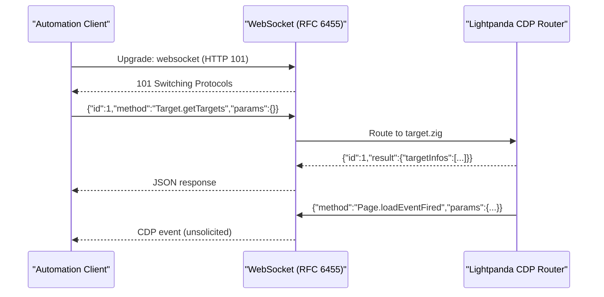
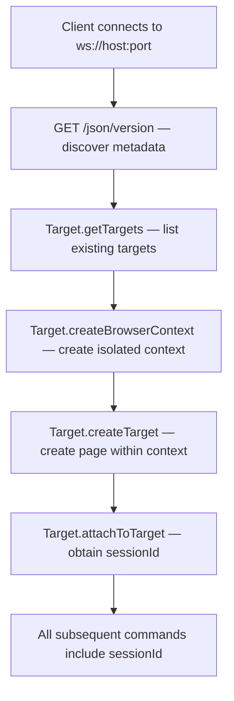
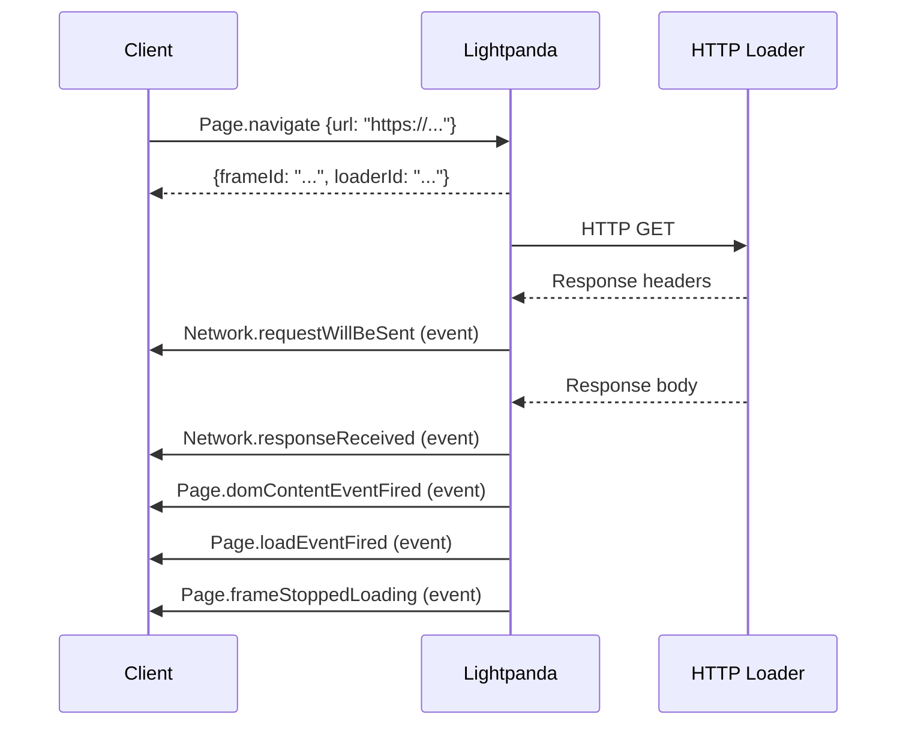
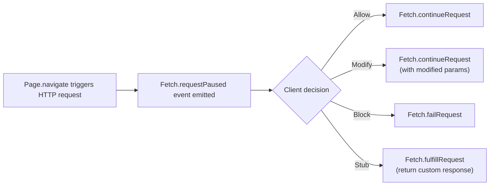

# CDP Protocol Reference

Lightpanda implements the [Chrome DevTools Protocol](https://chromedevtools.github.io/devtools-protocol/) over WebSocket. All Puppeteer and Playwright commands ultimately translate to CDP messages.

---

## Protocol Transport



**Message format (command):**
```json
{
  "id": 1,
  "method": "Domain.methodName",
  "params": { "paramName": "value" }
}
```

**Message format (response):**
```json
{
  "id": 1,
  "result": { "responseField": "value" }
}
```

**Message format (event):**
```json
{
  "method": "Domain.eventName",
  "params": { "eventField": "value" }
}
```

**Constants (`Config.zig`):**

| Constant | Value | Description |
|---|---|---|
| `CDP_MAX_HTTP_REQUEST_SIZE` | 4096 bytes | Maximum size of the initial HTTP upgrade request |
| `CDP_MAX_MESSAGE_SIZE` | ~524,428 bytes | Maximum single CDP message size (512KB + protocol overhead) |

---

## Target Management

The `Target` domain controls the lifecycle of browser targets (contexts and pages).

### Establishing a Session



### Key Methods

| Method | Description |
|---|---|
| `Target.getTargets` | List all active targets |
| `Target.createBrowserContext` | Create an isolated browser context |
| `Target.disposeBrowserContext` | Destroy a context and all its pages |
| `Target.createTarget` | Create a new page target |
| `Target.closeTarget` | Close and dispose a page target |
| `Target.attachToTarget` | Start a CDP session for a specific target |
| `Target.detachFromTarget` | End a session |

---

## Page Domain

The `Page` domain controls navigation, lifecycle events, and page state.

### Navigation Flow



### Key Methods

| Method | Description |
|---|---|
| `Page.navigate` | Navigate to a URL |
| `Page.reload` | Reload the current page |
| `Page.getFrameTree` | Get the frame tree structure |
| `Page.enable` | Enable Page domain event reporting |
| `Page.disable` | Disable Page domain events |
| `Page.captureScreenshot` | Capture a PNG/JPEG screenshot |

### Key Events

| Event | Fired when... |
|---|---|
| `Page.loadEventFired` | Window `load` event fires |
| `Page.domContentEventFired` | `DOMContentLoaded` fires |
| `Page.frameNavigated` | A frame completes navigation |
| `Page.frameStoppedLoading` | A frame stops loading |

---

## DOM Domain

The `DOM` domain provides access to the parsed DOM tree.

| Method | Description |
|---|---|
| `DOM.getDocument` | Return root document node (with depth control) |
| `DOM.querySelector` | Run a CSS selector in a node scope |
| `DOM.querySelectorAll` | Run a CSS selector returning all matches |
| `DOM.getOuterHTML` | Return serialized outer HTML |
| `DOM.getAttribute` | Read a specific attribute |
| `DOM.setAttributeValue` | Write a specific attribute |
| `DOM.removeAttribute` | Remove an attribute |
| `DOM.focus` | Focus a node |

---

## Runtime Domain

Executes JavaScript within the browser context.

| Method | Description |
|---|---|
| `Runtime.evaluate` | Evaluate a JavaScript expression in the global context |
| `Runtime.callFunctionOn` | Call a function on a remote object |
| `Runtime.getProperties` | Enumerate properties of a remote object |

!!! info "What Puppeteer uses"
    `page.evaluate()` translates to `Runtime.callFunctionOn` under the hood with your function serialized as a string.

---

## Network Domain

Intercept and observe HTTP requests.

| Method | Description |
|---|---|
| `Network.enable` | Enable network event reporting |
| `Network.disable` | Disable network events |
| `Network.setExtraHTTPHeaders` | Inject headers into all outbound requests |
| `Network.getCookies` | Return cookies for specified URLs |
| `Network.setCookies` | Set one or more cookies |
| `Network.clearBrowserCookies` | Remove all cookies |
| `Network.setUserAgentOverride` | Override the User-Agent string |
| `Network.emulateNetworkConditions` | Simulate latency/bandwidth throttling |

---

## Fetch Domain

The `Fetch` domain provides request interception (pausing requests before they are sent).



| Method | Description |
|---|---|
| `Fetch.enable` | Enable interception with optional URL/resource type patterns |
| `Fetch.disable` | Disable interception |
| `Fetch.continueRequest` | Allow a paused request to proceed |
| `Fetch.failRequest` | Abort a paused request |
| `Fetch.fulfillRequest` | Return a stubbed response |

---

## Input Domain

Simulates user input events.

| Method | Description |
|---|---|
| `Input.dispatchMouseEvent` | Simulate mouse movement, click, scroll |
| `Input.dispatchKeyEvent` | Simulate keyboard press / release |
| `Input.insertText` | Insert text at current focus |

---

## Storage Domain

Manages browser storage state.

| Method | Description |
|---|---|
| `Storage.clearDataForOrigin` | Clear cookies, local storage, cache for an origin |
| `Storage.getCookies` | Get cookies for a storage partition |
| `Storage.setCookies` | Set cookies |
| `Storage.clearCookies` | Remove all cookies |

---

## HTTP Discovery Endpoints

When `serve` is running, Lightpanda exposes standard CDP discovery endpoints over HTTP:

| Endpoint | Description |
|---|---|
| `GET /json/version` | Browser metadata, WebSocket debugger URL |
| `GET /json/list` | Active pages and their WebSocket endpoints |
| `GET /json` | Alias for `/json/list` |
