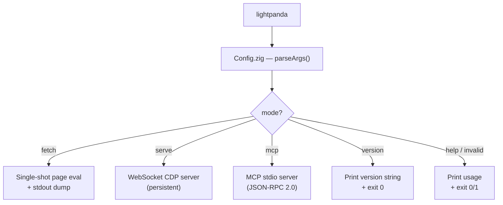

# Operations Reference

This document describes how to operate Lightpanda in production environments, including configuration tuning, log interpretation, telemetry management, and troubleshooting.

---

## Execution Modes



### `fetch` — Single-Shot Mode

The `fetch` command is stateless — each invocation is a fresh browser session. It is suitable for:
- CI pipeline checks
- Crawling pipelines that orchestrate individual processes
- Debugging page rendering in isolation

```bash
./lightpanda fetch \
  --dump html \
  --wait-until networkidle \
  --log-format pretty \
  --log-level debug \
  https://example.com
```

### `serve` — Persistent Server Mode

The `serve` command maintains a pool of sessions. Use this for:
- Sustained Puppeteer/Playwright automation
- Browser pools serving multiple workers
- AI agent loops requiring repeated page interactions

```bash
./lightpanda serve \
  --host 0.0.0.0 \
  --port 9222 \
  --advertise-host 10.0.1.5 \
  --timeout 60 \
  --cdp-max-connections 32 \
  --log-level warn \
  --log-format logfmt
```

!!! tip "Production Logging"
    In production, use `--log-format logfmt` for machine-parseable structured logs. This is the default in Release builds.

---

## Logging

### Log Levels

| Level | Meaning |
|---|---|
| `debug` | Verbose — all internal events. Not recommended in production. |
| `info` | Standard operational messages (default in debug builds). |
| `warn` | Non-fatal conditions that may require attention. |
| `error` | Recoverable errors. |
| `fatal` | Unrecoverable errors — process exits after logging. |

### Log Scopes

Scopes allow isolating verbose subsystem logs. Useful in high-throughput environments where `http` traffic events would dominate logs.

```bash
# Suppress HTTP and event-level logs
./lightpanda serve --log-filter-scopes http,event
```

Known scopes: `http`, `app`, `browser`, `mcp`, `telemetry`, `unknown_prop`, `event`.

### Log Format: pretty

Human-readable, aligned output. Suitable for development and debugging:
```
INFO  page : navigate . . . . . . . . . . . . . [+6ms]
      url = https://example.com/
      method = GET

INFO  http : request complete . . . . . . . . . [+140ms]
      source = xhr
      url = https://example.com/api/data.json
      status = 200
      len = 4770
```

### Log Format: logfmt

Space-separated key=value structured format. Compatible with Loki, Datadog, and similar ingestion pipelines:
```
level=info scope=page event=navigate url=https://example.com/ elapsed_ms=6
level=info scope=http event=request_complete source=xhr status=200 elapsed_ms=140
```

---

## Telemetry

Lightpanda collects anonymous usage telemetry by default. The telemetry subsystem is implemented in `src/telemetry/`.

### What Is Collected

Usage metrics used to prioritize feature development and track browser compatibility progress. No page content, URLs, or user data is transmitted.

### Disabling Telemetry

```bash
export LIGHTPANDA_DISABLE_TELEMETRY=true
```

Set this variable before launching any Lightpanda process. It is persistent across the session but not across shell restarts — add it to your shell profile or service environment configuration.

!!! info "Privacy Policy"
    For full details, see [lightpanda.io/privacy-policy](https://lightpanda.io/privacy-policy).

---

## Tuning for High-Throughput Workloads

### Connection Limits

| Parameter | CLI Flag | Recommendation |
|---|---|---|
| Active sessions | `--cdp-max-connections` | Set to match your worker count. Default: 16. |
| Accept queue | `--cdp-max-pending-connections` | Increase for bursty traffic. Default: 128. |
| Session timeout | `--timeout` | Increase for long-running agent loops. Default: 10s. |

### HTTP Concurrency

These parameters control parallelism within a single page load:

| Parameter | CLI Flag | Observation |
|---|---|---|
| Max concurrent requests | `--http-max-concurrent` | Controls how many XHR/Fetch calls can be in-flight simultaneously |
| Per-host connections | `--http-max-host-open` | Increase for CDN-heavy pages with many parallel assets |
| HTTP timeout | `--http-timeout` | Reduce for fast-fail behavior in crawler pipelines |

---

## Common Issues

??? failure "Port 9222 is already in use"
    Another process (including a previous Lightpanda instance or Chrome DevTools) is bound to port 9222.

    ```bash
    # Find the PID
    ss -tulpn | grep 9222   # Linux
    lsof -i :9222           # macOS

    # Kill the process
    kill -9 <PID>
    ```

    Alternatively, use `--port 9223` to bind to a free port.

??? failure "Session inactivity timeout — client disconnected"
    The automation client was inactive for longer than the `--timeout` value (default: 10 seconds). Increase the timeout:
    ```bash
    ./lightpanda serve --timeout 120
    ```

??? failure "HTTP fetch error: TLS verify failed"
    TLS certificate verification failed for an HTTPS target. If operating in a test environment with self-signed certificates, you can disable verification:
    ```bash
    ./lightpanda fetch --insecure-disable-tls-host-verification https://...
    ```
    !!! danger "Security Warning"
        Never use `--insecure-disable-tls-host-verification` in production. It disables host validation for all TLS connections made by that process.

??? failure "Page content appears incomplete (missing dynamic content)"
    The `wait-until` condition resolved before JavaScript finished updating the DOM. Try:
    - Switch from `--wait-until load` to `--wait-until networkidle`
    - Add `--wait-ms 3000` to allow time for deferred scripts
    - Use `--wait-selector .target-element` if a specific element's presence is the correct readiness signal

??? failure "Memory usage growing across sessions"
    Context or page resources are not being closed. In Puppeteer:
    ```javascript
    await page.close();
    await context.close();
    await browser.disconnect(); // does not stop the server
    ```

??? failure "Robots.txt blocking requests"
    If you started with `--obey-robots`, the target domain's `robots.txt` is disallowing the request path. Either remove `--obey-robots` or operate on an URL path that the `robots.txt` permits.
