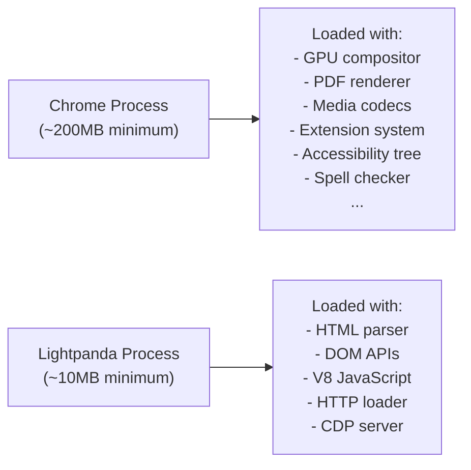
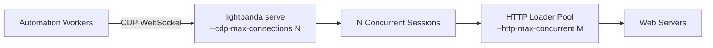

# Performance Reference

Lightpanda is designed for performance-critical automation workloads. This document presents benchmark methodology, characteristic measurements, and guidance for extracting peak performance.

---

## Benchmark Summary

Benchmarks were conducted against a [Lightpanda demo suite](https://github.com/lightpanda-io/demo/blob/main/BENCHMARKS.md) on an AWS EC2 m5.large instance requesting 933 real web pages over the network using `chromedp`.

| Metric | Chrome (Headless) | Lightpanda | Ratio |
|---|:-:|:-:|:-:|
| Memory per page | ~80MB | ~5MB | **16x less** |
| Wall-clock execution time | Baseline | ~9x faster | **9x faster** |
| Startup time | ~300–800ms | ~10ms | **Instant** |

!!! info "Benchmark Source"
    These numbers come from the [official Lightpanda benchmark repository](https://github.com/lightpanda-io/demo). They reflect real-world workloads, not synthetic microbenchmarks.

---

## Why Lightpanda Is Fast



Lightpanda's performance advantage is architectural. Chrome carries the full weight of a desktop application. Lightpanda is purpose-built for the subset of browser capabilities that automation requires.

### Key Design Decisions That Drive Speed

**1. No graphical rendering pipeline.** Lightpanda does not implement a layout engine, paint compositor, or GPU rendering path. Calls to `getBoundingClientRect()` return zero dimensions because there is no layout to compute.

**2. Zig's compile-time memory control.** Zig does not have a garbage collector. Memory is allocated and freed explicitly. There are no GC pause events that would otherwise create unpredictable latency spikes during JavaScript execution.

**3. Arena-scoped memory per page.** Rather than managing individual heap objects, Lightpanda uses arena allocators scoped to page lifetimes. Releasing a page frees all its memory in a single operation.

**4. libcurl connection pooling.** HTTP connections are reused across requests within a session. Persistent connections eliminate TCP handshake and TLS negotiation overhead for same-origin requests.

**5. Pre-compiled V8 snapshot (optional).** The V8 engine requires significant initialization work. Lightpanda supports embedding a pre-compiled snapshot into the binary (`-Dsnapshot_path=...`) to eliminate this cost at runtime.

---

## Startup Time

| Mode | Expected Startup | Notes |
|---|---|---|
| `fetch` (no snapshot) | ~50–100ms | V8 snapshot compiled at startup |
| `fetch` (embedded snapshot) | ~10ms | Snapshot loaded from binary |
| `serve` | ~10ms | Server ready to accept connections |

To embed the V8 snapshot and achieve minimum startup times:
```bash
# Step 1: Generate the snapshot binary
zig build snapshot_creator -- src/snapshot.bin

# Step 2: Build with the embedded snapshot
zig build -Doptimize=ReleaseFast -Dsnapshot_path=../../snapshot.bin
```

---

## Memory Profile

Lightpanda's memory footprint is substantially lower than Chrome because it skips all graphical subsystems. Practical measurements in production workloads:

| Workload | Peak Memory |
|---|---|
| Single idle session (serve) | ~10MB |
| Active page load (XHR-heavy) | ~30–50MB |
| 16 concurrent sessions | ~200–400MB |
| Chrome equivalent | ~1.2–3GB |

For memory-sensitive deployments, arena allocator scoping ensures that session memory is reliably released between navigations. There are no object pools that grow unboundedly.

---

## Concurrency Tuning

The optimal concurrency configuration depends on your target websites and infrastructure:



**Recommended starting configuration for a crawler:**
```bash
./lightpanda serve \
  --host 0.0.0.0 \
  --port 9222 \
  --cdp-max-connections 32 \
  --cdp-max-pending-connections 512 \
  --http-max-concurrent 20 \
  --http-max-host-open 8 \
  --timeout 60 \
  --log-level warn \
  --log-format logfmt
```

Adjust `--cdp-max-connections` to match the number of worker processes connecting simultaneously. A value much higher than your actual worker count wastes accept queue resources without benefit.
