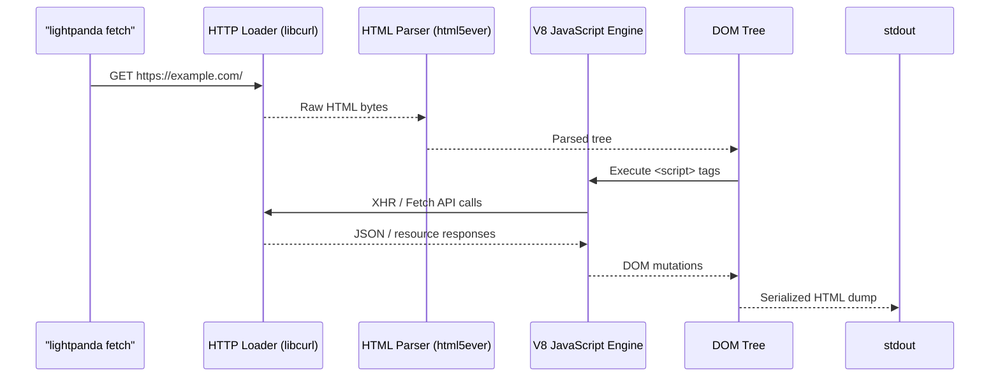

# Quick Start

This tutorial takes you from zero to a working Lightpanda-powered browser automation session in under five minutes. No source compilation required.

!!! abstract "Prerequisites"
    - Linux x86_64, macOS aarch64, or Windows with WSL2
    - Node.js v18+ (for Puppeteer examples)
    - Docker (optional, for the container path)

---

## Step 1 — Install Lightpanda

Download the pre-built binary for your platform from the nightly release channel.

=== "Linux (x86_64)"
    ```bash
    curl -L -o lightpanda \
      https://github.com/lightpanda-io/browser/releases/download/nightly/lightpanda-x86_64-linux
    chmod a+x ./lightpanda
    ```

=== "macOS (Apple Silicon)"
    ```bash
    curl -L -o lightpanda \
      https://github.com/lightpanda-io/browser/releases/download/nightly/lightpanda-aarch64-macos
    chmod a+x ./lightpanda
    ```

=== "Docker"
    Docker fetches and starts the container in a single command. The CDP server is exposed on port `9222`.
    ```bash
    docker run -d \
      --name lightpanda \
      -p 9222:9222 \
      lightpanda/browser:nightly
    ```

=== "Windows + WSL2"
    Inside a WSL2 terminal, follow the Linux installation path. Puppeteer and other clients may run on the Windows host and connect to the WSL network interface.

    ```bash
    # From within your WSL2 terminal
    curl -L -o lightpanda \
      https://github.com/lightpanda-io/browser/releases/download/nightly/lightpanda-x86_64-linux
    chmod a+x ./lightpanda
    ```

---

## Step 2 — Fetch a Page (Single Shot)

Use the `fetch` command to evaluate and dump a URL to standard output. This does not start a persistent server.

```bash
./lightpanda fetch \
  --log-format pretty \
  --log-level info \
  https://demo-browser.lightpanda.io/campfire-commerce/
```

**What happens internally:**



The `--log-format pretty` flag produces human-readable structured output. Each log line shows the elapsed time from process start, providing precise insight into where time is spent during page evaluation.

---

## Step 3 — Start the CDP Server

For sustained automation workflows, start `lightpanda serve`. This launches the WebSocket Chrome DevTools Protocol server that Puppeteer, Playwright, and chromedp connect to.

```bash
./lightpanda serve \
  --host 127.0.0.1 \
  --port 9222 \
  --log-format pretty \
  --log-level info
```

Expected output:
```
INFO  telemetry : telemetry status . . .  [+0ms]
      disabled = false

INFO  app : server running . . . . . . .  [+0ms]
      address = 127.0.0.1:9222
```

The server is now accepting WebSocket connections on `ws://127.0.0.1:9222`.

!!! tip "Inactivity Timeout"
    By default, idle CDP sessions are disconnected after **10 seconds**. For long-running agents, increase this with `--timeout 300` (seconds). The maximum accepted value is `604800` (1 week).

---

## Step 4 — Connect Puppeteer

Install `puppeteer-core` (which does not bundle a bundled Chrome binary, avoiding unnecessary downloads):

```bash
npm install puppeteer-core
```

Create a script that points Puppeteer's `browserWSEndpoint` to Lightpanda:

```javascript title="scrape.mjs"
'use strict';
import puppeteer from 'puppeteer-core';

// Point Puppeteer at the Lightpanda CDP server
const browser = await puppeteer.connect({
  browserWSEndpoint: "ws://127.0.0.1:9222",
});

const context = await browser.createBrowserContext(); // (1)!
const page = await context.newPage();

await page.goto('https://demo-browser.lightpanda.io/amiibo/', {
  waitUntil: "networkidle0", // (2)!
});

// Extract all anchor hrefs from the rendered DOM
const links = await page.evaluate(() => {
  return Array.from(document.querySelectorAll('a'))
    .map(el => el.getAttribute('href'))
    .filter(Boolean);
});

console.log(links);

await page.close();
await context.close();
await browser.disconnect(); // (3)!
```

1. Each `BrowserContext` is isolated. Cookies and storage are not shared between contexts.
2. `networkidle0` waits until there are zero in-flight network requests for at least 500ms, ensuring all XHR and Fetch calls complete.
3. `disconnect()` closes the WebSocket but does not terminate the Lightpanda server. The `serve` process continues accepting new connections.

Run the script:
```bash
node scrape.mjs
```

---

## Verification Checklist

- [x] Binary downloaded and executable
- [x] `fetch` command returns HTML output
- [x] `serve` command logs `server running` on port 9222
- [x] Puppeteer connects and returns DOM data

---

## Next Steps

<div class="grid cards" markdown>

- [Puppeteer Integration](puppeteer-walkthrough.md) — Advanced automation patterns with Puppeteer

- [Playwright Integration](playwright-walkthrough.md) — Using Playwright with compatibility considerations

- [Build from Source](../how-to/build-from-source.md) — Compile from the Zig source for custom builds

- [Architecture Reference](../reference/architecture.md) — Understand the internal component model

</div>

!!! warning "Playwright Compatibility"
    Playwright scripts may behave inconsistently across Lightpanda versions. Because Playwright dynamically selects execution strategies based on the browser's available Web APIs, adding a new API to Lightpanda may cause Playwright to route through previously untested code paths. Prefer Puppeteer for deterministic, production-grade automation.
