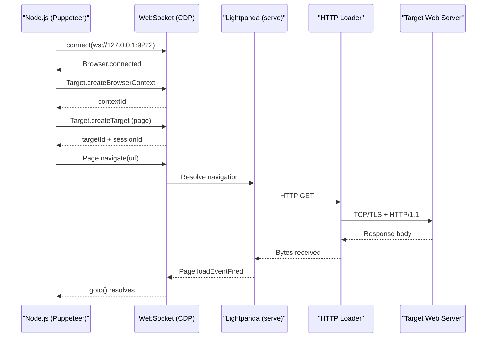

# Puppeteer Integration

This guide covers production-grade automation patterns using Puppeteer connected to Lightpanda. It goes beyond the quick start to address real-world concerns: context isolation, error recovery, network observation, and high-throughput scraping.

!!! abstract "Prerequisites"
    - Lightpanda `serve` running on `127.0.0.1:9222`
    - Node.js v18+
    - `npm install puppeteer-core`

---

## Connection Architecture

When using Puppeteer with Lightpanda, the control flow traverses two process boundaries:



Puppeteer communicates exclusively through CDP messages over the WebSocket. Lightpanda processes each command and dispatches the corresponding internal operation.

---

## Context Lifecycle Management

Browser contexts provide isolation boundaries. Each context has its own cookie jar, local storage, and cache. This is essential for concurrent scraping workflows to prevent session contamination.

```javascript title="context-management.mjs"
import puppeteer from 'puppeteer-core';

const browser = await puppeteer.connect({
  browserWSEndpoint: "ws://127.0.0.1:9222",
});

// Create a dedicated context for each scraping job
async function scrapeInIsolation(url) {
  const context = await browser.createBrowserContext();
  try {
    const page = await context.newPage();

    // Configure a timeout guard
    page.setDefaultNavigationTimeout(30_000);
    page.setDefaultTimeout(10_000);

    await page.goto(url, { waitUntil: 'networkidle0' });

    const result = await page.evaluate(() => ({
      title: document.title,
      links: Array.from(document.querySelectorAll('a[href]'))
        .map(a => a.href)
        .slice(0, 50),
    }));

    await page.close();
    return result;
  } finally {
    // Always close the context to release resources
    await context.close();
  }
}

const data = await scrapeInIsolation('https://demo-browser.lightpanda.io/amiibo/');
console.log(data);

await browser.disconnect();
```

!!! tip "Context vs. Page"
    You can open multiple pages within a single context, but they share cookies and storage. For full isolation between independent jobs, create separate contexts.

---

## Waiting Strategies

JavaScript-heavy applications require precise wait conditions. Lightpanda supports all standard Puppeteer wait mechanisms.

### Wait for Network Idle

Appropriate for pages that load data via XHR after the initial HTML parses.

```javascript
await page.goto(url, { waitUntil: 'networkidle0' }); // zero in-flight requests for 500ms
await page.goto(url, { waitUntil: 'networkidle2' }); // ≤2 in-flight requests for 500ms
```

### Wait for a DOM Element

Use this when a specific element's presence confirms that the JavaScript has rendered the critical content:

```javascript
await page.goto(url, { waitUntil: 'domcontentloaded' });
await page.waitForSelector('.product-grid', { timeout: 10_000 });
const products = await page.$$eval('.product-card', cards =>
  cards.map(c => c.querySelector('h2')?.textContent?.trim())
);
```

### Wait for a Custom JavaScript Condition

For SPAs that expose an internal readiness signal:

```javascript
await page.waitForFunction(
  () => window.__APP_READY__ === true,
  { timeout: 15_000, polling: 500 }
);
```

---

## Evaluating JavaScript in Page Context

`page.evaluate()` executes arbitrary JavaScript inside the browser's JavaScript context. The function argument is serialized, sent over CDP, executed by V8, and the return value is serialized back.

```javascript
// Extract structured data
const metadata = await page.evaluate(() => {
  const ld = document.querySelector('script[type="application/ld+json"]');
  try {
    return JSON.parse(ld?.textContent || 'null');
  } catch {
    return null;
  }
});

// Interact with forms
await page.evaluate(() => {
  document.querySelector('#search-input').value = 'automation tools';
  document.querySelector('#search-form').submit();
});
```

!!! warning "Serialization Limits"
    Return values from `page.evaluate()` are JSON-serialized. DOM nodes, functions, circular references, and `undefined` values cannot be returned. Use `page.evaluateHandle()` for DOM node references.

---

## Network Request Observation

Lightpanda supports CDP's `Network` domain. You can observe all HTTP requests and responses:

```javascript
// Enable network tracking
await page.setRequestInterception(false); // observation only
page.on('request', req => {
  console.log(`→ ${req.method()} ${req.url()}`);
});
page.on('response', res => {
  console.log(`← ${res.status()} ${res.url()}`);
});
page.on('requestfailed', req => {
  console.warn(`✗ ${req.url()} — ${req.failure()?.errorText}`);
});

await page.goto('https://demo-browser.lightpanda.io/campfire-commerce/');
```

---

## High-Throughput Concurrent Scraping

Lightpanda's low memory footprint makes high-concurrency patterns viable. The default `--cdp-max-connections 16` setting controls how many simultaneous CDP sessions the server accepts.

```javascript title="concurrent-scraper.mjs"
import puppeteer from 'puppeteer-core';

const URLS = [
  'https://demo-browser.lightpanda.io/amiibo/',
  'https://demo-browser.lightpanda.io/campfire-commerce/',
  // ... hundreds more
];

const CONCURRENCY = 8;

const browser = await puppeteer.connect({
  browserWSEndpoint: "ws://127.0.0.1:9222",
});

async function scrape(url) {
  const ctx = await browser.createBrowserContext();
  const page = await ctx.newPage();
  page.setDefaultNavigationTimeout(20_000);
  try {
    await page.goto(url, { waitUntil: 'networkidle0' });
    return { url, title: await page.title() };
  } catch (err) {
    return { url, error: err.message };
  } finally {
    await page.close();
    await ctx.close();
  }
}

// Process in controlled concurrency batches
const results = [];
for (let i = 0; i < URLS.length; i += CONCURRENCY) {
  const batch = URLS.slice(i, i + CONCURRENCY);
  const batchResults = await Promise.all(batch.map(scrape));
  results.push(...batchResults);
}

await browser.disconnect();
console.log(results);
```

!!! info "Server-Side Concurrency Limits"
    Start `lightpanda serve` with `--cdp-max-connections 32` to allow more simultaneous sessions. The `--cdp-max-pending-connections 256` flag controls the accept queue depth.

---

## Error Handling and Crash Recovery

```javascript
async function resilientNavigate(page, url, maxRetries = 3) {
  for (let attempt = 1; attempt <= maxRetries; attempt++) {
    try {
      await page.goto(url, { waitUntil: 'networkidle0', timeout: 30_000 });
      return;
    } catch (err) {
      if (attempt === maxRetries) throw err;
      const backoff = attempt * 1000;
      console.warn(`Navigation failed (attempt ${attempt}): ${err.message}. Retrying in ${backoff}ms`);
      await new Promise(r => setTimeout(r, backoff));
    }
  }
}
```

---

## Common Issues

??? failure "Connection refused on ws://127.0.0.1:9222"
    The Lightpanda `serve` process is not running or is bound to a different address. Verify with:
    ```bash
    ./lightpanda serve --host 127.0.0.1 --port 9222
    ```

??? failure "Navigation timeout exceeded"
    The page may have long-running scripts or external resources blocked. Try `networkidle2` instead of `networkidle0`, or increase the navigation timeout via `page.setDefaultNavigationTimeout(60_000)`.

??? failure "Evaluate returned undefined"
    The selector did not match, or the DOM mutation had not yet occurred. Add an explicit `page.waitForSelector()` call before `evaluate()`.
